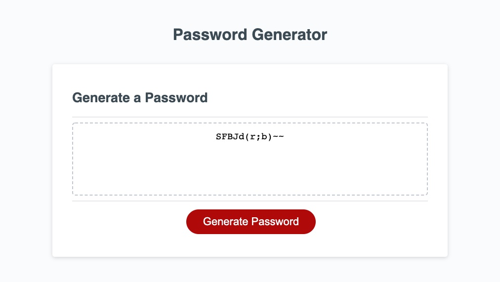

# Homework 3: Password Generator
## Objective:

The objective of this assignment was to use JavaScript to allow a user to create a password with a lenght between 8-128 characters as well as allowing the user to select if they would like to include symbols, numbers, lower case letters and upper case letters. 

The HTML and CSS files were provided for us. All of the work I did was in the script file. I started by creating universal variables and then creating functions to ask all of the questions. Next, I needed to determine which type of characters to pass into the allowable character set for the password. Finally, to generate the random password, I had to write a function that would select a character randomly and repeat the number of times that the user selected for the length of their password.  

## Screenshot of Homepage

## Link to deployed code
 https://kesjoberg.github.io/password-generator/
